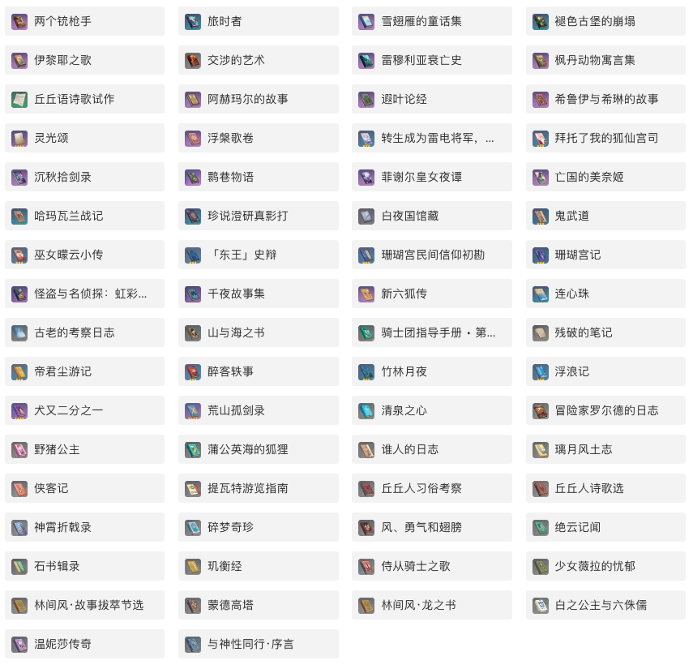

<br />
<p align="center">
  <h3 align="center">Genshin-Impact-BookQA-LLM</h3>

  <p align="center">
   		基于量化大模型的原神书目问答工程 (由 LangChain Haystack ChatGLM Mistral OLlama 构造)
    <br />
  </p>
</p>

[In English](README_EN.md)

## 简要介绍

### 背景
[《原神》](https://genshin.hoyoverse.com/en/) 是由米哈游（miHoYo）开发、出品在大陆中国和全球市场上由 HoYoverse发布的动作角色玩家游戏，其环境采用了动画风格的开放世界设计，
战斗系统基于元素魔法和角色换位。

在游戏中描述了部分背景设定，可以参考[书籍](https://bbs.mihoyo.com/ys/obc/channel/map/189/68?bbs_presentation_style=no_header)。
让我们看一下。（这些书目内容是本工程包含的）


本项目是一个尝试构建基于不同大模型的中文问答系统，采用RAG（Retrieval Augmented Generation）架构。

### 实时演示


|名称 | HuggingFace空间链接 |
|---------|--------|
| Genshin Impact Book QA Haystack Demo 📈 | https://huggingface.co/spaces/svjack/genshin-impact-bookqa-haystack |

该Demo使用Huggingface InferenceApi调用[mistralai/Mistral-7B-Instruct-v0.2](https://huggingface.co/mistralai/Mistral-7B-Instruct-v0.2)来执行问答任务。
因为底层模型不是针对中文的但具有比大多数低于10B模型更好的推理能力。您可以视为免费预览版。

 <br/><br/>

## 安装和运行
### 安装和运行步骤
在概念上，这个项目可以分为两部分，Basic\_Part和LLM\_Part。 <br/>
* <b>Basic\_Part</b>包含模块：[LangChain](https://github.com/langchain-ai/langchain) [SetFit](https://github.com/huggingface/setfit)，您应该通过下面的命令安装它们 <br/>
```bash
pip install -r basic_requirements.txt
```
* <b>LLM\_Part</b>是您需要选择安装的模块之一：[HayStack](https://github.com/deepset-ai/haystack) [chatglm.cpp](https://github.com/li-plus/chatglm.cpp)
 [llama-cpp-python](https://github.com/abetlen/llama-cpp-python) [ollama](https://github.com/ollama/ollama)<br/> <br/>

以下是各种LLM repo类型及其安装和运行命令
|LLM 工程名称 | LLM 模型 | Linux安装命令 | 运行Gradio Demo命令 |
|---------|--------|--------|--------|
| HayStack | Mistral-7B (基于 huggingface inference) | pip install -r basic_requirements.txt && pip install haystack-ai==2.0.0b5 | python haystack_bookqa_gradio.py |
| llama-cpp-python | Mistral-7B (基于 llama-cpp) | pip install -r basic_requirements.txt && pip install llama-cpp-python==0.2.55 | python mistral_bookqa_gradio.py |
| chatglm.cpp | chatglm3-6b | pip install -r basic_requirements.txt && pip install chatglm-cpp==0.3.1 | python chatglm_bookqa_gradio.py |
| ollama | Qwen-7B | pip install -r basic_requirements.txt && wget https://ollama.com/install.sh && sh ./install.sh && pip install ollama==0.1.6 && sudo systemctl start ollama | python ollama_qwen7b_bookqa_gradio.py |

### 运行结果
下面是两个问题在不同模型上的运行结果

|    | Question                       | HayStack                                                                                                                                                                                                                                                                                                                                                                                                 | Mistral                                                                                                                                                                                                                                                                                                                                                                                                                                                                                                                                                                                                                                                                                                                                                                                                                                                                                                | ChatGLM-6B                                                                                                                                                                                                                                                                                                                                                               | QWen-7B                                                                                                                                                                                                                                                      |
|---:|:---------------------------|:---------------------------------------------------------------------------------------------------------------------------------------------------------------------------------------------------------------------------------------------------------------------------------------------------------------------------------------------------------------------------------------------------------|:-------------------------------------------------------------------------------------------------------------------------------------------------------------------------------------------------------------------------------------------------------------------------------------------------------------------------------------------------------------------------------------------------------------------------------------------------------------------------------------------------------------------------------------------------------------------------------------------------------------------------------------------------------------------------------------------------------------------------------------------------------------------------------------------------------------------------------------------------------------------------------------------------------|:-------------------------------------------------------------------------------------------------------------------------------------------------------------------------------------------------------------------------------------------------------------------------------------------------------------------------------------------------------------------------|:-------------------------------------------------------------------------------------------------------------------------------------------------------------------------------------------------------------------------------------------------------------|
|  1 | 岩王帝君是一个什么样的人？ | 岩王帝君是一位古老的神明，在古代中被广泛敬仰和信仰。他是公正、决断、冷酷无私的神明，处事公正，决断无情，但缺乏凡人应有的感情。他的法度能保证交易公平、生活安全有序，同时从信仰中强化着自己的存在和力量。但即使是神，也无法左右凡人的信仰和质疑。即使是公道的守护神，也无法将规则钉入每个人心底。在某个女人来到他的工坊要求雕刻真实的岩王肖像的条件下，他闭门雕琢了三日，最终成形了一方玉牌上的岩王肖像。 | 岩王帝君是一位古老而强大的神明之一，在璃月地区拥有重大影响力。他曾经有过仙兽作战，战斗结束后，仙兽失去了在神战中守护凡人的意义，便选择隐居而生。有些仙兽仍然渴望守护璃月，向岩王帝君祈求将肉身化作永恒的磐岩，被允许成实。在璃月历史中，霓裳花被视为岩王帝君的象征之一，同时也是璃月人日常生活中常见到的物品之一，用于加工绸段和制香膏等用途。在璃月历史中也有传说，有一块星星坠落造成了璃月地区的巨渊和美玉金石，而一小块星碎在群岩中落下，被称为「遁玉陵」，这个古老遗迹中有许多古老残垣，传说名字「遁玉」意味着「美玉遁逃之处」。在璃月港西北方有一位名叫玉匠的人，他喜欢以令人意想不到的方式完成委托，如果客人要求他雕刻一张岩神肖像，他可能会雕刻出一只野猪或者其他奇怪形状。玉匠曾经遇到了一位女人，她要求他雕刻出真实的岩神肖像，否则她不会付钱。玉匠约定了三日之内完成任务。第一天玉匠与好友宴饮阔论，拒绝任何委托；第二天玉匠出门登山访玉；第三天玉匠才开始闭门雕琢璞玉，直到深夜才完成任务。 | 岩王帝君是一个神秘的人物，他的形象在无数的故事传说中得以展现。他订立规则与契约，却不强迫凡人以权威的完美模板生活。他深知规则与契约仅是手段而非目的，真正的平衡与隽永在于每一个人的觉醒与抉择。他有着深不可测的力量和智慧，同时也是一个善良和宽容的人。虽然关于岩王帝君的具体形象和故事很多，但我们无法确定他的真实身份和特点。只能从这些传说中了解到他的一些特点和品质。 | 岩王帝君不仅是提瓦特大地的统治者，也被他的子民纪念、崇拜，甚至爱戴。这表明他可能有着慈祥和被尊敬的一面，同时也显示了他的威严和统治地位。                                                                                                                     |
| 2 | 灵光颂的内容是什么样的？   | 灵光颂的内容是一种诗歌，它描述了那伽朱那呀（Bodhisattva Avalokitesvara）得到万种灵光的帮助，并使用这些灵光保护大地、洁净人们、开辟道路给善灵、滋养花海的善灵等。它们无论是在悲怨的河流中逆渡，还是面对天外漆黑的阴霾，都能保护住自己。这种灵光永恒地指引人们上升道路。                                                                                                                                   | 这首诗称为"灵光颂"，内容描述了一位人类或是其他实体，得到了万种灵光的帮助，已经超越了死亡，洁净了高天的渊薮，洗净了无罪之人的罪孽，在大地中蕴藏了一切业种。这位实体在世间的荣耀只是种子现行的幻象，但它已经逆渡悲怨的河流，渴饮甘露，为善灵开辟道路，使智慧的慈光普照四方。它得到了万种灵光的保护，滋养着花海的善灵，它们在渴望洁净的心中，即使天外漆黑的阴霾出现也无法侵蚀它们的身形。                                                                                                                                                                                                                                                                                                                                                                                                                                                                                                                 | 灵光颂的内容主要是描述了灵光的力量和作用，以及它对人类和自然的祝福和保护。其中提到了灵光洗净亡者的罪孽，帮助人们超度到无悲苦的净土；灵光也洁净高天的渊薮，使污泥退去，慑服于正法；灵光将指引人们上升的道路。灵光还滋养着花海的善灵，保护着草木之神的末裔和百战劫余的勇士，使它们身形不受天外漆黑阴霾的侵蚀。                                                             | 灵光颂的内容主要是对灵光的歌颂和祈求。诗中描述了得助于万种灵光的人物已经超度尘土，洗净罪孽，往生净土。同时，诗中还描绘了在黑暗中逆流而上的形象，以及他们对于善灵开辟道路，智慧慈光普照四方的作用。总的来说，灵光颂的内容充满积极向上、追求真理和智慧的意涵。 |

更多的比较结果可以在下面的文件中查看 [compare_resuilt](compare_result.md)


### 注意事项
建议在GPU上运行演示（10GB GPU显存足够，由于工程结构，有GPU加速要求） <br/><br/>

## 数据集和模型
### 数据集
|名称 | 类型 | HuggingFace数据集链接 |
|---------|--------|--------|
| svjack/genshin_book_chunks_with_qa_sp |《原神》图书内容 | https://huggingface.co/datasets/svjack/genshin_book_chunks_with_qa_sp |
| svjack/bge_small_book_chunks_prebuld |《原神》图书Embedding | https://huggingface.co/datasets/svjack/bge_small_book_chunks_prebuld |

### 基础模型
|名称 | 类型 | HuggingFace模型链接 |
|---------|--------|--------|
| svjack/bge-small-book-qa |Embedding模型 | https://huggingface.co/svjack/bge-small-book-qa |
| svjack/setfit_info_cls |文本分类器 | https://huggingface.co/svjack/setfit_info_cls |

### LLM模型
|名称 | 类型 | HuggingFace模型链接 |
|---------|--------|--------|
| svjack/chatglm3-6b-bin |ChatGLM3-6B 4bit量化 | https://huggingface.co/svjack/chatglm3-6b-bin |
| svjack/mistral-7b |Mistral-7B 4bit量化 | https://huggingface.co/svjack/mistral-7b |

<br/><br/>

## 架构
此项目采用传统RAG结构。<br/>
* [svjack/bge-small-book-qa](https://huggingface.co/svjack/bge-small-book-qa)是召回《原神》图书内容（按 LangChain TextSplitter 分割）的自训练嵌入模型。
* [svjack/setfit_info_cls](https://huggingface.co/svjack/setfit_info_cls)是确定查询与内容相关性的自训练文本分类器。 <br/> <br/>

LLM部分包括四种不同的llm框架：
[HayStack](https://github.com/deepset-ai/haystack) [chatglm.cpp](https://github.com/li-plus/chatglm.cpp) 
[llama-cpp-python](https://github.com/abetlen/llama-cpp-python) [ollama](https://github.com/ollama/ollama)，
对于embedding所回召的内容执行过滤分类来回答问题。<br/>

### 注意事项
[HayStack](https://github.com/deepset-ai/haystack) [llama-cpp-python](https://github.com/abetlen/llama-cpp-python) 
和 [ollama](https://github.com/ollama/ollama) 都是包含许多不同llm类型的项目。您可以尝试使用不同的llm，并在Gradio脚本中更改模型名称或模型文件。<br/> 
* 对于理解查询和上下文的能力，建议使用 Huggingface Inference API 中的Mistral-7B或ollama中的Intel/neural-chat。<br/>
* 对于中文回答质量的能力，建议使用 ollama中的Qwen-7B或chatglm.cpp中的ChatGLM3-6B。

<br/><br/>

<!-- CONTACT -->
## Contact

<!--
Your Name - [@your_twitter](https://twitter.com/your_username) - email@example.com
-->
svjack - https://huggingface.co/svjack - svjackbt@gmail.com - ehangzhou@outlook.com

<!--
Project Link: [https://github.com/your_username/repo_name](https://github.com/your_username/repo_name)
-->
Project Link:[https://github.com/svjack/Genshin-Impact-BookQA-LLM](https://github.com/svjack/Genshin-Impact-BookQA-LLM)


<!-- ACKNOWLEDGEMENTS -->
## Acknowledgements
* [Genshin Impact](https://genshin.hoyoverse.com/en/)
* [Huggingface](https://huggingface.co)
* [Mistral-7B](https://mistral.ai/news/announcing-mistral-7b/)
* [LangChain](https://github.com/langchain-ai/langchain)
* [SetFit](https://github.com/huggingface/setfit)
* [HayStack](https://github.com/deepset-ai/haystack)
* [chatglm.cpp](https://github.com/li-plus/chatglm.cpp)
* [llama-cpp-python](https://github.com/abetlen/llama-cpp-python)
* [ollama](https://github.com/ollama/ollama)
* [svjack](https://huggingface.co/svjack)

