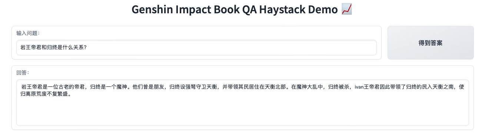

<br />
<p align="center">
  <h3 align="center">Genshin-Impact-BookQA-LLM</h3>

  <p align="center">
   		基于量化大模型的原神书目问答工程 (由 LangChain Haystack ChatGLM Mistral OLlama 构造)
    <br />
  </p>
</p>

[In English](README_EN.md)

## 简要介绍

### 背景
[《原神》](https://genshin.hoyoverse.com/en/) 是由米哈游（miHoYo）开发、出品在大陆中国和全球市场上由 HoYoverse发布的动作角色玩家游戏，其环境采用了动画风格的开放世界设计，
战斗系统基于元素魔法和角色换位。

在游戏中描述了部分背景设定，可以参考[书籍](https://bbs.mihoyo.com/ys/obc/channel/map/189/68?bbs_presentation_style=no_header)。
让我们看一下。（这些书目内容是本工程包含的）


本项目是一个尝试构建基于不同大模型的中文问答系统，采用RAG（Retrieval Augmented Generation）架构。

### 实时演示


|名称 | HuggingFace空间链接 |
|---------|--------|
| Genshin Impact Book QA Haystack Demo 📈 | https://huggingface.co/spaces/svjack/genshin-impact-bookqa-haystack |

该Demo使用Huggingface InferenceApi调用[mistralai/Mistral-7B-Instruct-v0.2](https://huggingface.co/mistralai/Mistral-7B-Instruct-v0.2)来执行问答任务。
因为底层模型不是针对中文的但具有比大多数低于10B模型更好的推理能力。您可以视为免费预览版。

 <br/><br/>

## 安装和运行
### 安装和运行步骤
在概念上，这个项目可以分为两部分，Basic\_Part和LLM\_Part。 <br/>
* <b>Basic\_Part</b>包含模块：[LangChain](https://github.com/langchain-ai/langchain) [SetFit](https://github.com/huggingface/setfit)，您应该通过下面的命令安装它们 <br/>
```bash
pip install -r basic_requirements.txt
```
* <b>LLM\_Part</b>是您需要选择安装的模块之一：[HayStack](https://github.com/deepset-ai/haystack) [chatglm.cpp](https://github.com/li-plus/chatglm.cpp)
 [llama-cpp-python](https://github.com/abetlen/llama-cpp-python) [ollama](https://github.com/ollama/ollama)<br/> <br/>

以下是各种LLM repo类型及其安装和运行命令
|LLM 工程名称 | LLM 模型 | Linux安装命令 | 运行Gradio Demo命令 |
|---------|--------|--------|--------|
| HayStack | Mistral-7B (基于 huggingface inference) | pip install -r basic_requirements.txt && pip install haystack-ai==2.0.0b5 | python haystack_bookqa_gradio.py |
| llama-cpp-python | Mistral-7B (基于 llama-cpp) | pip install -r basic_requirements.txt && pip install llama-cpp-python==0.2.55 | python mistral_bookqa_gradio.py |
| chatglm.cpp | chatglm3-6b | pip install -r basic_requirements.txt && pip install chatglm-cpp==0.3.1 | python chatglm_bookqa_gradio.py |
| ollama | Qwen-7B | pip install -r basic_requirements.txt && wget https://ollama.com/install.sh && sh ./install.sh && pip install ollama==0.1.6 && sudo systemctl start ollama | python ollama_qwen7b_bookqa_gradio.py |

### 注意事项
建议在GPU上运行演示（10GB GPU显存足够） <br/><br/>

## 数据集和模型
### 数据集
|名称 | 类型 | HuggingFace数据集链接 |
|---------|--------|--------|
| svjack/genshin_book_chunks_with_qa_sp |《原神》图书内容 | https://huggingface.co/datasets/svjack/genshin_book_chunks_with_qa_sp |
| svjack/bge_small_book_chunks_prebuld |《原神》图书Embedding | https://huggingface.co/datasets/svjack/bge_small_book_chunks_prebuld |

### 基础模型
|名称 | 类型 | HuggingFace模型链接 |
|---------|--------|--------|
| svjack/bge-small-book-qa |Embedding模型 | https://huggingface.co/svjack/bge-small-book-qa |
| svjack/setfit_info_cls |文本分类器 | https://huggingface.co/svjack/setfit_info_cls |

### LLM模型
|名称 | 类型 | HuggingFace模型链接 |
|---------|--------|--------|
| svjack/chatglm3-6b-bin |ChatGLM3-6B 4bit量化 | https://huggingface.co/svjack/chatglm3-6b-bin |
| svjack/mistral-7b |Mistral-7B 4bit量化 | https://huggingface.co/svjack/mistral-7b |

<br/><br/>

## 架构
此项目采用传统RAG结构。<br/>
* [svjack/bge-small-book-qa](https://huggingface.co/svjack/bge-small-book-qa)是召回《原神》图书内容（按 LangChain TextSplitter 分割）的自训练嵌入模型。
* [svjack/setfit_info_cls](https://huggingface.co/svjack/setfit_info_cls)是确定查询与内容相关性的自训练文本分类器。 <br/> <br/>

LLM部分包括四种不同的llm框架：
[HayStack](https://github.com/deepset-ai/haystack) [chatglm.cpp](https://github.com/li-plus/chatglm.cpp) 
[llama-cpp-python](https://github.com/abetlen/llama-cpp-python) [ollama](https://github.com/ollama/ollama)，
对于embedding所回召的内容执行过滤分类来回答问题。<br/>

### 注意事项
[HayStack](https://github.com/deepset-ai/haystack) [llama-cpp-python](https://github.com/abetlen/llama-cpp-python) 
和 [ollama](https://github.com/ollama/ollama) 都是包含许多不同llm的项目。您可以尝试使用不同的llms，并在Gradio脚本中更改模型名称或模型文件。<br/> 
* 对于理解查询和上下文的能力，建议使用 Huggingface Inference API 中的Mistral-7B或ollama中的Intel/neural-chat。<br/>
* 对于中文回答质量的能力，建议使用 ollama中的Qwen-7B或chatglm.cpp中的ChatGLM3-6B。

<br/><br/>

<!-- CONTACT -->
## Contact

<!--
Your Name - [@your_twitter](https://twitter.com/your_username) - email@example.com
-->
svjack - https://huggingface.co/svjack - svjackbt@gmail.com - ehangzhou@outlook.com

<!--
Project Link: [https://github.com/your_username/repo_name](https://github.com/your_username/repo_name)
-->
Project Link:[https://github.com/svjack/Genshin-Impact-BookQA-LLM](https://github.com/svjack/Genshin-Impact-BookQA-LLM)


<!-- ACKNOWLEDGEMENTS -->
## Acknowledgements
* [Genshin Impact](https://genshin.hoyoverse.com/en/)
* [Huggingface](https://huggingface.co)
* [Mistral-7B](https://mistral.ai/news/announcing-mistral-7b/)
* [LangChain](https://github.com/langchain-ai/langchain)
* [SetFit](https://github.com/huggingface/setfit)
* [HayStack](https://github.com/deepset-ai/haystack)
* [chatglm.cpp](https://github.com/li-plus/chatglm.cpp)
* [llama-cpp-python](https://github.com/abetlen/llama-cpp-python)
* [ollama](https://github.com/ollama/ollama)
* [svjack](https://huggingface.co/svjack)

