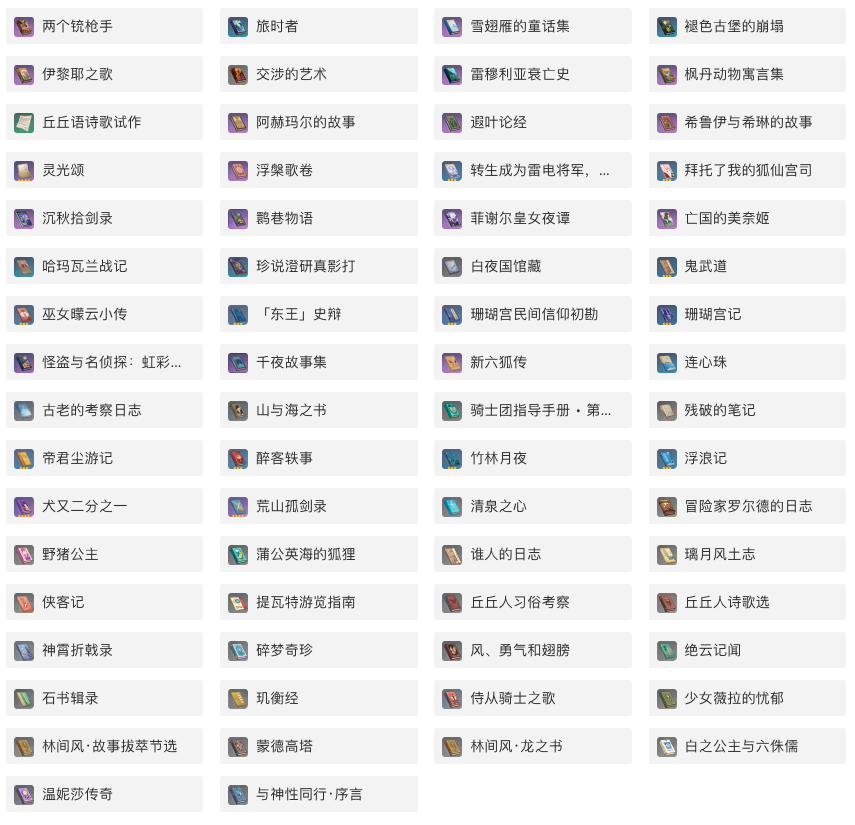
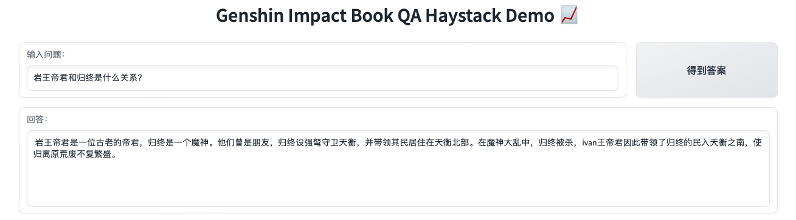

<!-- PROJECT LOGO -->
<br />
<p align="center">
  <h3 align="center">Genshin-Impact-BookQA-LLM</h3>

  <p align="center">
   		A Book Question Answer Project supported by LLM (build by LangChain Haystack ChatGLM Mistral OLlama)
    <br />
  </p>
</p>

[中文介绍](README.md)

## Brief introduction

### BackGround
[Genshin Impact](https://genshin.hoyoverse.com/en/) is an action role-playing game developed by miHoYo, published by miHoYo in mainland China and worldwide by Cognosphere, 
HoYoverse. The game features an anime-style open-world environment and an action-based battle system using elemental magic and character-switching. 

In the Game, some background settings are described by [Books](https://bbs.mihoyo.com/ys/obc/channel/map/189/68?bbs_presentation_style=no_header).
Let's take a shot.


This project is an attempt to build Chinese Q&A on the LLM support RAG system.

### Try Demo on the fly


|Name | HuggingFace Space link |
|---------|--------|
| Genshin Impact Book QA Haystack Demo 📈 | https://huggingface.co/spaces/svjack/genshin-impact-bookqa-haystack |

The Demo use Huggingface Inference Api that call [mistralai/Mistral-7B-Instruct-v0.2](https://huggingface.co/mistralai/Mistral-7B-Instruct-v0.2) to perform Q&A tasks.
Because the base model is not fintuned in Chinese but have more better inference capabilities than most models. You can take this deploy version as a free preview version. 



## Installation
In the concept, the project can be divided into two parts, Basic_Part and LLM_Part. <br/>
* <b>Basic_Part</b> contains modules: [LangChain](https://github.com/langchain-ai/langchain) [SetFit](https://github.com/huggingface/setfit) you should install all of them By <br/>
```bash
pip install -r basic_requirements.txt
```
* <b>LLM_Part</b> are modules that you should choose one to install: [HayStack](https://github.com/deepset-ai/haystack) [chatglm.cpp](https://github.com/li-plus/chatglm.cpp) [llama-cpp-python](https://github.com/abetlen/llama-cpp-python) [ollama](https://github.com/ollama/ollama)<br/>

|LLM Repo Name | Install Command in Linux |
|---------|--------|
| HayStack | pip install haystack-ai==2.0.0b5 |
| chatglm.cpp | pip install chatglm-cpp |
| llama-cpp-python | pip install llama-cpp-python==0.2.55 |
| ollama | wget https://ollama.com/install.sh && sh ./install.sh && pip install ollama && sudo systemctl start ollama |


